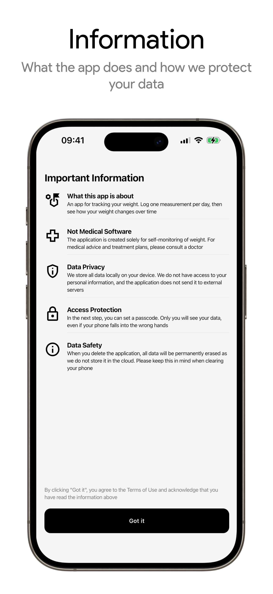
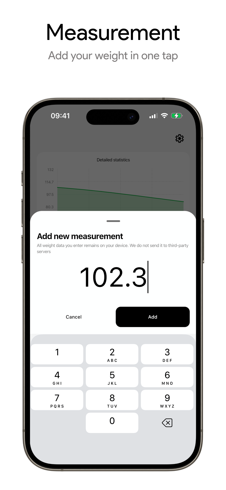
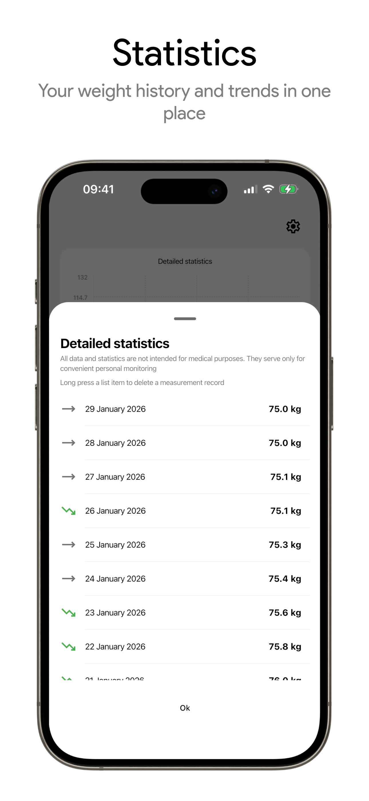
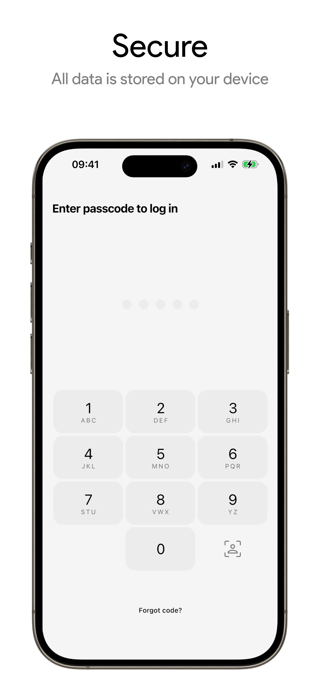

## WeightObserver - Mobile App

<p align="center">
  <!-- Download links – add your store / release URLs when ready -->
  <a href="https://play.google.com/store/apps/details?id=com.chknkv.weightobserver"></a>
  <a href="#"></a>
</p>

<p align="center">
  <!-- Badges (Shields.io); GitHub serves them via camo.githubusercontent.com -->
  
  
  
  
</p>

---

- [What is WeightObserver?](#what-is-weightobserver)
- [Technical overview](#technical-overview)
  - [Build and run](#build-and-run)
  - [Tech stack](#tech-stack)
  - [Project structure](#project-structure)
  - [Other details](#other-technical-details)

## What is WeightObserver?

**WeightObserver** is a simple, focused mobile app for tracking your weight over time. Log one measurement per day, view a clear trend chart, and keep everything on your device — no accounts, no cloud, no tracking.

The app is built for **privacy and control**. All data is stored locally using SQLite. Nothing is sent to external servers. We don’t have access to your measurements; only you do. You can optionally protect access with a 5‑digit passcode and biometrics (fingerprint or Face ID), so your data stays private even if someone else uses your phone.

WeightObserver is **not medical software**. It’s meant for personal self‑monitoring only. For health advice, diagnosis, or treatment, please consult a doctor.

The project is **open source**. You can inspect the code, build the app yourself, or contribute. The full source is available on [GitHub](https://github.com/chknkv/WeightObserver-App).

<p align="center">
  
  
  
  
</p>

## Technical overview

### Build and run

**Prerequisites**

- **Android:** Android SDK, `ANDROID_HOME` set (or SDK at `~/Library/Android/sdk` on macOS). A device or emulator with USB debugging enabled.
- **iOS:** Xcode, iOS Simulator or a physical iPhone/iPad. For device builds, code signing must be configured.

**Commands**

From the project root:

```bash
# Android – build, install, and launch on connected device/emulator
./scripts/android-run.sh

# iOS – build, install, and launch on Simulator or connected device
./scripts/ios-run.sh
```

The scripts use Gradle for the shared Kotlin framework and, on iOS, invoke `xcodebuild` for the app. They pick a single device/simulator if multiple are available.


### Tech stack

|   | Area | Technologies |
| -- | ------ | -------------- |
| 🧩 | **Language & multiplatform** | [Kotlin 2.3](https://kotlinlang.org), [Kotlin Multiplatform (KMP)](https://kotlinlang.org/docs/multiplatform.html) |
| 🎨 | **UI** | [Compose Multiplatform](https://kotlinlang.org/compose-multiplatform/) |
| 🧭 | **Navigation** | [Decompose](https://arkivanov.github.io/Decompose/) |
| ⚙️ | **DI** | [Koin](https://insert-koin.io/) |
| 💾 | **Local storage** | [SQLDelight](https://cashapp.github.io/sqldelight/), [multiplatform-settings](https://github.com/russhwolf/multiplatform-settings) |
| 🔐 | **Security** | AndroidX Security Crypto, optional passcode, biometrics |
| 📦 | **Other** | [kotlinx-datetime](https://github.com/Kotlin/kotlinx-datetime), [kotlinx-serialization](https://github.com/Kotlin/kotlinx.serialization), [kotlinx-coroutines](https://github.com/Kotlin/kotlinx.coroutines), [Napier](https://github.com/AAkira/Napier) |

### Project structure

```
├── androidApp/                 # Android application module
├── iosApp/                     # iOS app (Xcode project, Swift UI host)
├── shared/                     # KMP shared UI root, navigation, Compose
├── core/
│   ├── core-utils/             # Date formatting, app version, open URL, etc.
│   ├── core-designsystem/      # Theming, typography, buttons, alerts, snackbars
│   ├── core-session/           # SQLDelight DB, WeightRepository, SessionRepository, LanguageManager
│   └── core-authentication/    # Passcode, biometrics, secure settings
├── feature/
│   ├── feature-welcome/        # Onboarding: info, language, create passcode, biometry
│   └── feature-main/           # Main screen, weight chart, measurements, settings, detailed stats
└── scripts/                    # Build & run helpers
```

- **Features:** Welcome flow (information → language → passcode → optional biometry), main screen with line chart (31‑day windows, swipe), add measurement, detailed statistics, settings (language, passcode, info, open source link, clear data).
- **Platforms:** Android (minSdk 24) and iOS 15+ (simulator + device). UI and business logic live in `commonMain`; small `androidMain` / `iosMain` parts for platform-specific code (e.g. biometrics, secure storage).

### Other technical details

- **Localization:** English and Russian. Language can be chosen in onboarding and later in settings.
- **Database:** SQLite via SQLDelight. Single table `WeightMeasurement(date, weight)`; one record per day.
- **Release build (Android):** Minification and shrinking enabled; ProGuard rules in `androidApp/proguard-rules.pro`. Signing via `RELEASE_*` Gradle properties when provided.

---

<p align="center">
  <sub>If you find WeightObserver useful, consider giving the repo a ⭐ on GitHub.</sub>
</p>
